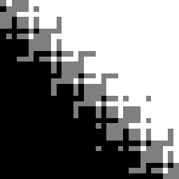

# Geogram Predicates
A crate for rust interoperability with `geogram`s _robust predicates_; via `cxx`.

Geogram is a scientifically proven, well-documented, feature-rich geometry processing library, which leverages _"[...] arithmetic filters (Meyer and Pion), expansion arithmetics (Shewchuk) and simulation of simplicity (Edelsbrunner)."_ <br>
Be sure to check it out [here](https://github.com/BrunoLevy/geogram).

It yields easy access to dependecy-free parts of its code base, as so called _Pluggable Software Modules_ (PSM), which in turn make it easy to write `cxx_bridges` for these.

## Example

With that, you can add geometry predicates to your rust project, without the need to re-implement existing state-of-the-art software.
E.g. using geograms incircle predicate for triangles in `rust` looks like this: 
```rust
use geogram_predicates as gp

// Define three points that form a triangle
let a = [0.0, 0.0];
let b = [2.0, 0.0];
let c = [1.0, 1.0];

// Define two points, to test against the triangles circum-circle
let p_in = [1.0, -0.4];
let p_out = [1.0, -1.2];

let is_in_circle_p_in = gp::in_circle_2d_SOS(&a, &b, &c, &p_in);
assert_eq!(1, is_in_circle_p_in);

let is_in_circle_p_out = gp::in_circle_2d_SOS(&a, &b, &c, &p_out);
assert_eq!(-1, is_in_circle_p_out);

// Do something fancy based on the result
// ...
```

## Visualizing Advantages of Robust Predicates

Below are visualizations comparing naive and robust `orient_2d` implementations. You can generate these images yourself by running the [`examples/orient_2d/`](examples/orient_2d/).

|            | Naive                   | Robust                   |
|------------|-------------------------|--------------------------|
| `orient_2d`| |  |

## List of currently supported predicates
### 2D
- [x] in_circle_2D_SOS()
- [x] orient_2d()
- [x] orient_2dlifted_SOS()
- [x] points_are_identical_2d()


### 3D
- [x] in_sphere_3d_SOS()
- [x] orient_3d()
- [x] orient_3dlifted_SOS()
- [x] points_are_identical_3d()

### Other
- [x] geo_sgn()
- [x] initialize()
- [x] show_stats()
- [x] terminate()

There are a lot of predictes still to be implemented. If you are in need for a specific one have a look at the [geograms predicate list](https://brunolevy.github.io/geogram/predicates_8h.html). The bridge for any one predicate is implemented pretty quickly, so this crate is easily extendable.

## Design
The API to the `geogram predicates` is designed with the following design principles in mind:
- **Relation to geogram**: the _function names_, _signatures_ and _doc strings_ should be as close as possible to the original. This keeps maintaining, updating and comparing as simple as possible

## Contribution
If you see something as
- a missing geogram predicate,
- software desing principles that could be improved,
- potential bugs,
- ambiguous documentation, typos etc.,
- ...

feel free to open a PR to address this.

## Acknowledgements
Credits go to [geogram](https://github.com/BrunoLevy/geogram)
 and [cxx](https://github.com/dtolnay/cxx), which make this project possible.

Also [georust/robust](https://github.com/georust/robust) should be mentioned, for helping set up example with visualizations.

## License
The files in `include/geogram_predicates_psm` are licensed w.r.t.

> Copyright (c) 2000-2022 Inria All rights reserved.
>
> Redistribution and use in source and binary forms, with or without modification, are permitted provided that the following conditions are met:
>
> Redistributions of source code must retain the above copyright notice, this list of conditions and the following disclaimer. Redistributions in binary form must reproduce the above copyright notice, this list of conditions and the following disclaimer in the documentation and/or other materials provided with the distribution. Neither the name of the ALICE Project-Team nor the names of its contributors may be used to endorse or promote products derived from this software without specific prior written permission.
>
> THIS SOFTWARE IS PROVIDED BY THE COPYRIGHT HOLDERS AND CONTRIBUTORS "AS IS" AND ANY EXPRESS OR IMPLIED WARRANTIES, INCLUDING, BUT NOT LIMITED TO, THE IMPLIED WARRANTIES OF MERCHANTABILITY AND FITNESS FOR A PARTICULAR PURPOSE ARE DISCLAIMED. IN NO EVENT SHALL THE COPYRIGHT HOLDER OR CONTRIBUTORS BE LIABLE FOR ANY DIRECT, INDIRECT, INCIDENTAL, SPECIAL, EXEMPLARY, OR CONSEQUENTIAL DAMAGES (INCLUDING, BUT NOT LIMITED TO, PROCUREMENT OF SUBSTITUTE GOODS OR SERVICES; LOSS OF USE, DATA, OR PROFITS; OR BUSINESS INTERRUPTION) HOWEVER CAUSED AND ON ANY THEORY OF LIABILITY, WHETHER IN CONTRACT, STRICT LIABILITY, OR TORT (INCLUDING NEGLIGENCE OR OTHERWISE) ARISING IN ANY WAY OUT OF THE USE OF THIS SOFTWARE, EVEN IF ADVISED OF THE POSSIBILITY OF SUCH DAMAGE.

The rest of this software is licensed under <a href="LICENSE-APACHE">Apache License, Version 2.0</a> (similar to cxx's license).